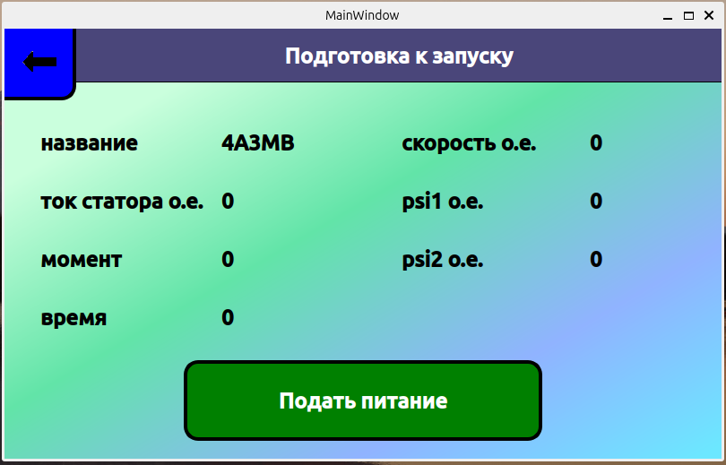
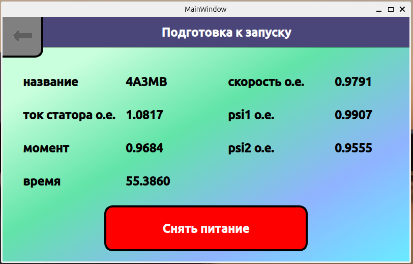
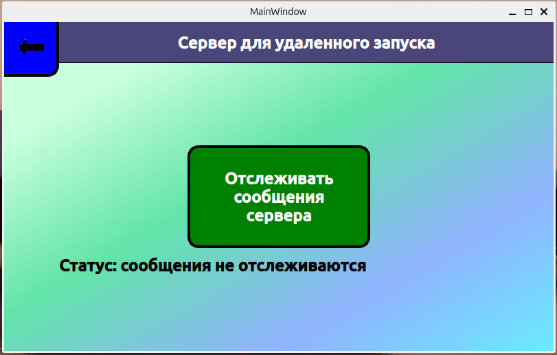
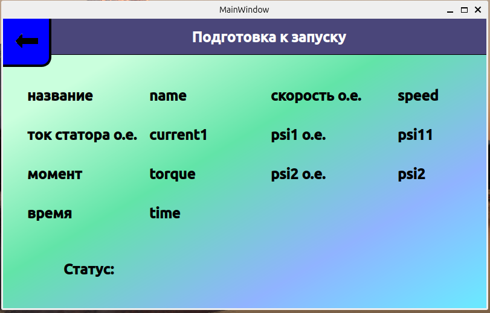
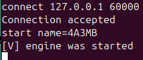
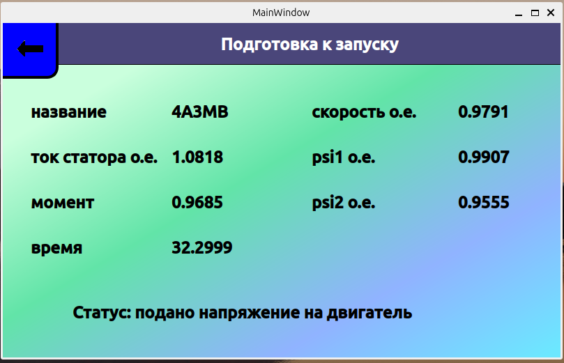
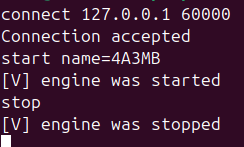
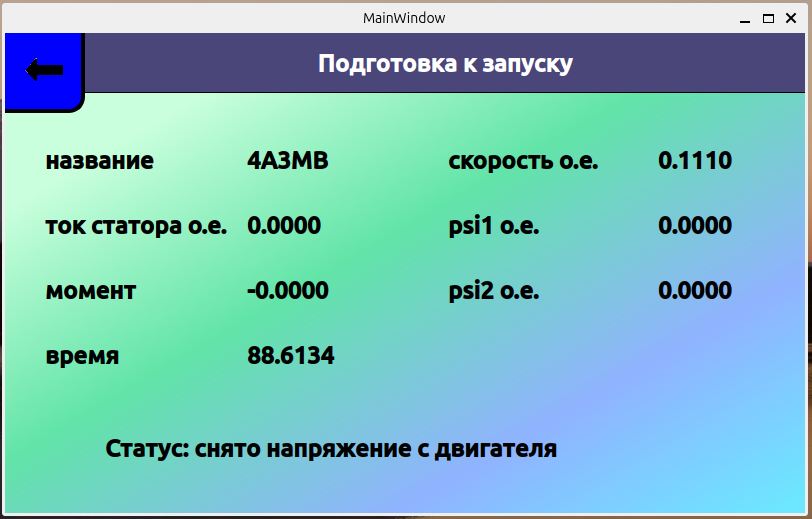

# ElectricEngineManager
Графическое приложение на qt6 для управления электрическим
двигателем как локально так и удаленно. Симуляция электрического двигателя выполняется своей
библиотекой [AsyncElectricEngineLib](https://github.com/Alex12124/AsyncElectricEngineLib). Также предоставляется [клиент](https://github.com/Alex12124/ElectricEngineManagerClient) для передачи сообщений для удаленного управления.

Локально двигатель управляется кнопкой
"Подать питание" или "Снять питание"



Для удаленного управления во время запуска программы запускается отдельный поток
исполнения для работы сервера. Сервер принимает protobuf сообщения и складывает их в очередь запросов. Главный поток исполнения начинает периодически проверять очередь запросов при нажатии кнопки на отслеживание сообщений сервера.



После нажатия отслеживания сообщений, если будет обнаружен подключенный клиент, то будет переход на страницу для запуска удаленных проверок



Будет производиться опрос очереди запросов. Если из очереди будет извлечено сообщение на "Запуск", то на двигатель будет подано питание.





Если из очереди будет извлечено сообщение на "Остановку", то с двигателя будет снято питание.





После обработки сообщения и выполнения действия с двигателем нужно отправить в очередь ответов соответствующее сообщение protobuf. Далее запускается задача в виде stackfull корутины для обработки сообщения из очереди ответов. Для приема сообщений клиента также работает задача в виде stackfull корутины. Различие в том, что на ответ клиенту каждый раз запускается новая задача, тогда как на прием сообщений работает одна задача в цикле.


## Установка
Клонируйте репозиторий командой
```bash
git clone --recurse-submodules https://github.com/Alex12124/ElectricEngineManager.git 
cd ElectricEngineManager/
```
### 1 шаг:
**Для Linux:**

Установите пакет python3-venv, если он ещё не установлен:
```bash
sudo apt-get install python3-venv
```
Установите виртуальное окружение python3 в корневой директории
и активируйте его
```bash
python3 -m venv .venv
source .venv/bin/activate
```
В самом конце чтобы деактивировать виртуальное окружение, введите команду:
```bash
deactivate
```

**Для Windows**:

Установите виртуальное окружение python3 в корневой директории
и активируйте его
```PowerShell
python -m venv .venv
.venv\Scripts\activate.bat
```
В самом конце чтобы деактивировать виртуальное окружение, введите команду:
```PowerShell
deactivate
```

### 2 шаг:
Далее напишите команду для установки conan
```bash
pip install conan
```
Команда для определения стандартного профиля.
```bash
conan profile detect --force
```
Команда для установки нужных зависимостей
```bash
conan install . --build=missing
```

### 3 шаг:
Активируем окружения conan
```bash
source build/Release/generators/conanbuild.sh
source build/Release/generators/conanrun.sh
```
Для Windows запустите соответствующие bat файлы.

Выполняем команду, которая доступна с версии cmake 3.23. Для того, чтобы
не указывать напрямую toolchain файл.
```bash
cmake --preset conan-release
```
Далее
```bash
cd build/Release/
cmake ../../ -DCMAKE_BUILD_TYPE=Release
cmake --build .
```
Деактивируем все окружения
```bash
source generators/deactivate_conanbuild.sh
source generators/deactivate_conanrun.sh
deactivate
```
В Windows также запускаете соответствующие bat файлы.